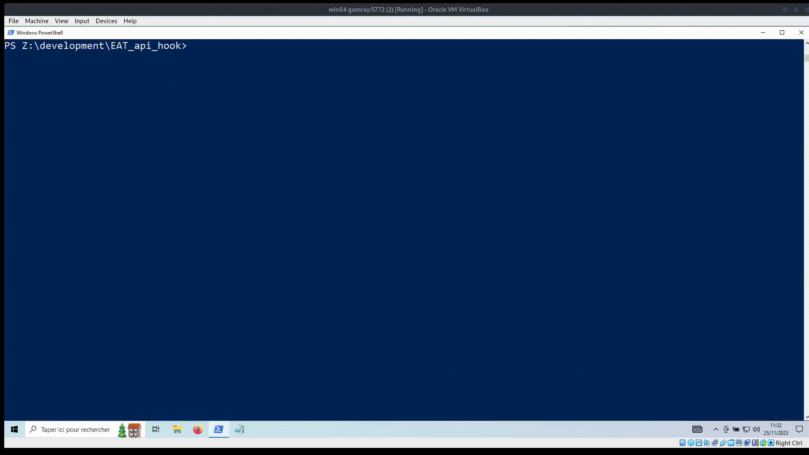

# EAT_hooking

Proof of concept of EAT hooking.

Consist of a simple C program that will change it's Export Table to modify the address of the function `LoadLibraryA`.

# Compilation

```
$ gcc EAT_hook.c -o EAT_hook.exe
```

# Example:

